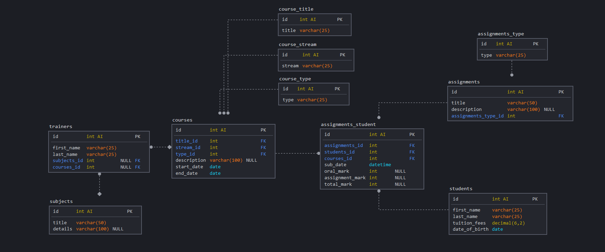

# Private school CLI app

 

SQL files located under `/src/db/`

1. install dependencies: `npm i`
2. import _database_
3. import _inserts_
4. create _views_
5. start program via `npm start`

 

##### ER Diagram

 
 
 
 
 
 
 
 

---

enjoy
